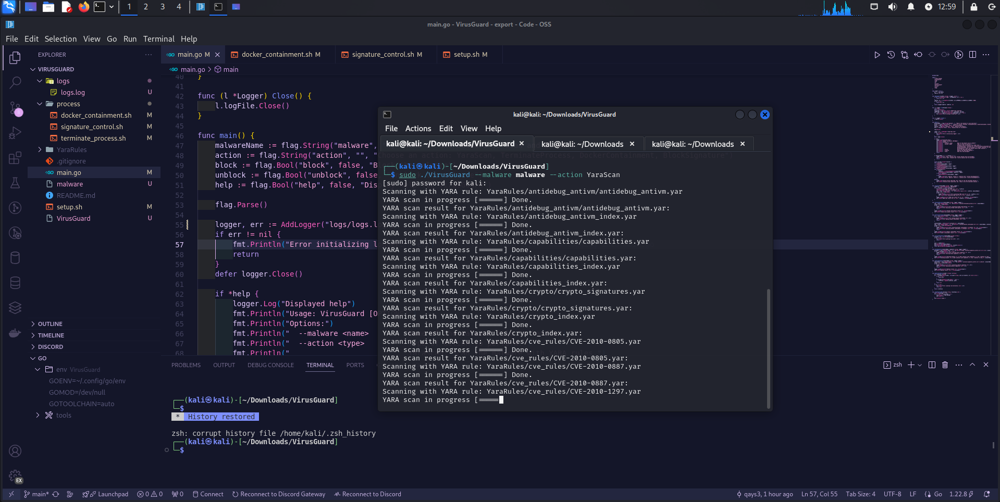
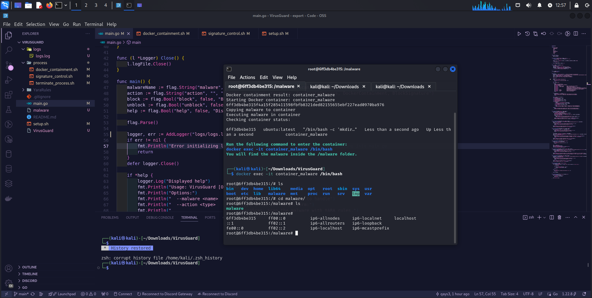
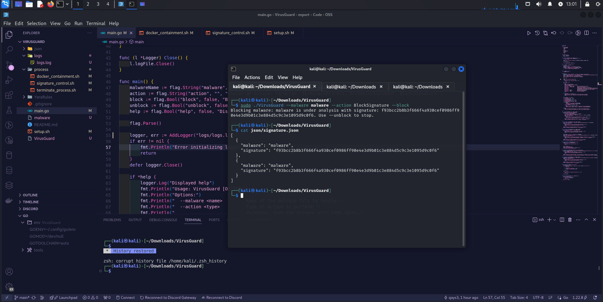

## VirusGuard


**VirusGuard** is part of the **MalWatch Suite**, a tool specifically designed for malware scanning and providing a safe environment for protection. VirusGuard can terminate malicious processes running in the background and track signatures to identify potential threats. If you want to execute malware in a virtual machine without the safe environment, you can still monitor all the threads and stop them by tracking the signature.

---

### Project Directory Structure

```
/VirusGuard/
├── main.go
├── .gitignore
├── README.md
├── setup.sh
├── img/
├── YaraRules/
├── process/
│   ├── terminate_process.sh
│   ├── signature_control.sh
│   └── docker_containment.sh

```
## Table of Contents

1. **[VirusGuard Overview](#virusguard)**
2. **[Project Directory Structure](#project-directory-structure)**
3. **[Main Components](#main-components)**
   - [1. `main.go`](#1-maingo)
   - [2. `process/terminate_process.sh`](#2-processterminate_processsh)
   - [3. `process/docker_containment.sh`](#3-processdocker_containmentsh)
   - [4. `setup.sh`](#4-setupsh)
4. **[Usage Instructions](#usage-instructions)**
5. **[Example Usage](#example-usage)**
6. **[New Features](#new-features)**
7. **[Commands](#commands)**
   - [Yara Scan](#to-scan-the-malware-with-yara-rules)
   - [Terminate Process](#to-terminate-all-running-processes-associated-with-the-malware)
   - [Docker Containment](#to-run-the-malware-in-a-docker-container-to-isolate-its-execution)
   - [Block Signature](#to-block-a-malware-signature)
   - [Unblock Signature](#to-unblock-a-malware-signature)
8. **[Contributors](#contributors)**
9. **[Credits](#credits)**

 
### 1. `main.go`

The core of VirusGuard, containing the processes that handle malware scanning, YARA scanning, process termination, Docker containment, and signature blocking/unblocking. The logger tracks relevant events and errors, making it easier to monitor activities and threats.

```go
func main() {
	malwareName := flag.String("malware", "", "Name of the malware to scan and block")
	action := flag.String("action", "", "Choose an action: YaraScan, TerminateProcess, DockerContainment, BlockSignature")
	block := flag.Bool("block", false, "Block the malware")
	unblock := flag.Bool("unblock", false, "Unblock the malware")
	help := flag.Bool("help", false, "Display help for VirusGuard")

	flag.Parse()

	logger, err := AddLogger("logs/application.log")
	if err != nil {
		fmt.Println("Error initializing logger:", err)
		return
	}
	defer logger.Close()

	if *help {
		logger.Log("Displayed help")
		fmt.Println("Usage: VirusGuard [OPTIONS]")
		fmt.Println("Options:")
		fmt.Println("  --malware <name>         Name of the malware file to handle")
		fmt.Println("  --action <type>          Type of action to perform:")
		fmt.Println("                           YaraScan: Scan the malware with YARA rules.")
		fmt.Println("                           TerminateProcess: Terminate all running processes associated with the malware.")
		fmt.Println("                           DockerContainment: Run the malware in a Docker container to isolate its execution.")
		fmt.Println("                           BlockSignature: Block the malware while under analysis.")
		fmt.Println("  --block                  Block the specified malware.")
		fmt.Println("  --unblock                Unblock the specified malware.")
		fmt.Println("  --help                   Show this help message")
		return
	}

	if *malwareName == "" || *action == "" {
		logger.Log("Error: both --malware and --action options must be provided")
		fmt.Println("Error: both --malware and --action options must be provided")
		return
	}

	switch strings.ToLower(*action) {
	case "yarascan":
		yaraScan(*malwareName, logger)
	case "terminateprocess":
		TerminateProcess(*malwareName, logger)
	case "dockercontainment":
		dockerContainment(*malwareName, logger)
	case "blocksignature":
		if *block {
			signature := calculateSignature(*malwareName)
			blockSignature(*malwareName, signature, logger)
		} else if *unblock {
			unblockSignature(*malwareName, logger)
		} else {
			logger.Log("Error: Specify --block or --unblock with --action BlockSignature")
			fmt.Println("Error: Specify --block or --unblock with --action BlockSignature")
		}
	default:
		logger.Log("Invalid action specified. Use --help to see the available options.")
		fmt.Println("Invalid action specified. Use --help to see the available options.")
	}
}
```

---

### 2. `process/terminate_process.sh`

This script terminates processes identified as malware.

[process/terminate_process.sh](process/terminate_process.sh)

---

### 3. `process/docker_containment.sh`

This script isolates suspicious processes in Docker containers for safe analysis.

[process/docker_containment.sh](process/docker_containment.sh)

---

### 4. `setup.sh`

Sets up the required environment and dependencies for VirusGuard.

[setup.sh](setup.sh)

---

### 5. Usage Instructions

1. **Make the scripts executable**:
   ```bash
   chmod +x setup.sh
   ```

2. **Run the installation script**:
   ```bash
   ./setup.sh
   ```

3. **Compile the Go program**:
   ```bash
   cd VirusGuard
   go build -o VirusGuard main.go
   ```

4. **Run the VirusGuard tool**:
   ```bash
   sudo ./VirusGuard --malware <malware_name> --action <YaraScan|SignatureBlocking|TerminateProcess|DockerContainment>
   ```

---

### Example Usage

To contain malware in Docker:
```bash
sudo ./VirusGuard --malware mymalware.exe --action DockerContainment
```

---

### New Features

- **Signature Blocking**: Enables the blocking of malware based on specific signatures.
- **Background Process Management**: Use the `--block` and `--unblock` options to control malware threads in the background.

---

###  Commands
- To Scan the malware with YARA rules
```bash
sudo ./VirusGuard --malware <malware_name> --action YaraScan 
```


- To Terminate all running processes associated with the malware.
```bash
sudo ./VirusGuard --malware <malware_name> --action TerminateProcess
```

-To Run the malware in a Docker container to isolate its execution.
```bash
sudo ./VirusGuard --malware <malware_name> --action DockerContainment
```



- To block a malware signature:
  ```bash
  sudo ./VirusGuard --malware <malware_name> --action SignatureBlocking --block
  ```

- To unblock a malware signature:
  ```bash
  sudo ./VirusGuard --malware <malware_name> --action SignatureBlocking --unblock
  ```



## Contributors

<div style="display: flex; align-items: center; margin-bottom: 20px;">
    <a href="https://github.com/qays3" style="text-decoration: none; display: flex; align-items: center;">
        
    </a>

</div>

## Credits
[qays3](https://github.com/qays3) ([Support qays](https://buymeacoffee.com/hidden))
